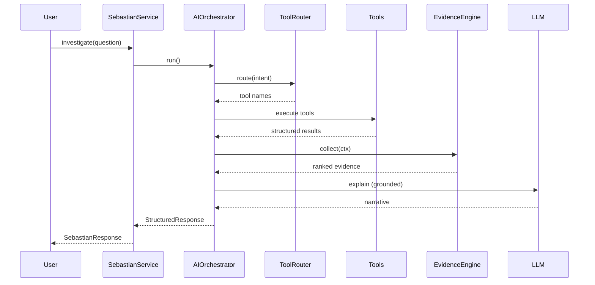

# Phase 8 — Sébastien AI Intelligence Platform

Sébastien is an **AI Intelligence Platform** for investigators — not a chatbot, not an LLM wrapper.

## Architecture

```
User
  ↓
Sebastian Interface (SebastianService / InvestigationAssistant)
  ↓
AIOrchestrator
  ↓
InvestigationOrchestrator (intent → validate → resolve → tools)
  ↓
ToolRouter + CapabilityRegistry
  ↓
Tools (read-only) + RAG Engine
  ↓
EvidenceEngine + ReasoningEngine
  ↓
LLM (explain only)
  ↓
StructuredResponse
```

## Package Layout

```
ai/
├── core/           # AIOrchestrator, StructuredResponse, observability
├── tools/          # CapabilityRegistry, ToolRouter
├── evidence/       # Evidence model + EvidenceEngine
├── reasoning/      # ReasoningEngine
├── memory/         # MemoryManager (LIVE/SIMULATION isolated)
├── sessions/       # InvestigationSessionManager
├── cache/          # SemanticCache
├── security/       # ReadOnlyPolicy, EnvironmentGuard
├── agents/         # Future agent stubs (AgentRegistry)
├── services/       # SebastianService
├── rag/            # RAG pipeline (retrieval)
├── investigation/  # Investigation engine, tools, orchestrator
├── prompts/        # Versioned prompt templates
├── providers/      # LLM provider abstraction
├── reports/        # Report generation
└── api/            # FastAPI routes
```

## Tool Registry

Tools register via `CapabilityRegistry`. Adding a tool requires **zero orchestrator changes**:

```python
registry.register(MyTool(), ToolCapability(name="my_tool", intents=("investigate_user",)))
```

Built-in tools: `resolve_entity`, `behavior`, `risk`, `alerts`, `personnel`, `timeline`, `relationship`, `search`, `dashboard`, `report`.

## Investigation Workflow

1. Resolve target (entity resolution)
2. Route intent → tools (ToolRouter)
3. Execute tools (read-only)
4. Investigation engine merges structured findings
5. Evidence engine collects, scores, ranks, cites
6. Reasoning engine prepares analysis package
7. LLM explains grounded context only
8. StructuredResponse returned

## Environment Isolation

`PlatformEnvironment.LIVE` and `PlatformEnvironment.SIMULATION` never mix. `EnvironmentGuard` enforces filter boundaries. `MemoryManager` stores per-environment buckets.

## Security

`ReadOnlyPolicy` — AI never modifies evidence, risk scores, alerts, or pipeline results.

## Future Extension Points

- Multi-agent execution via `AgentRegistry`
- Hybrid RAG search in `rag/`
- Persistent semantic cache backend
- MITRE, OSINT, translation tools
- PDF report export
- Provider plugins (Anthropic, Gemini, Azure)

## Sequence (one investigation turn)


