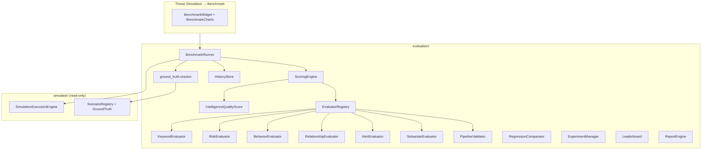

# Phase 10 — Intelligence Validation & Benchmarking Framework

Automated quality assurance for the intelligence platform. Measures detection accuracy, behavioral analytics, relationship analysis, Sebastian responses, and pipeline performance using **hidden ground truth** from synthetic scenarios.

## Isolation

| Layer | Scope |
|-------|--------|
| Package | `evaluation/` only |
| API | `/api/evaluation/*` (additive mount in `server.py`) |
| Data | Simulation engine + in-memory history |
| Production | **Untouched** — no Mongo, no live monitoring |

Ground truth is resolved **only inside `evaluation/`** — never exposed during simulation UI display.

## Architecture



## Evaluation Workflow

1. **Load dataset** — built-in or imported scenario IDs (`DatasetManager`)
2. **Run simulation** — `BenchmarkRunner` executes ticks via `SimulationExecutionEngine`
3. **Capture output** — pipeline results per message
4. **Resolve ground truth** — match scenario hidden labels (evaluation-only)
5. **Run evaluators** — keyword, risk, behavior, relationship, alert, pipeline, Sebastian
6. **Compute IQS** — weighted Intelligence Quality Score
7. **Store history** — benchmark record with trend data

## Benchmark Workflow

```
POST /api/evaluation/benchmark/run
  → BenchmarkConfig (ticks, users, dataset_id, weights)
  → BenchmarkRunner.run()
  → { benchmark_id, iqs, subsystems, confusion_matrix, trend }
```

Session evaluation (Threat Simulation):

```
GET /api/evaluation/benchmark/session/{session_id}
  → pipeline_inspections from simulator facade
  → evaluate without re-running simulation
```

## Regression Workflow

```
GET /api/evaluation/benchmark/regression?baseline_id=X&candidate_id=Y
  → RegressionComparator.compare()
  → { verdict: improved|regressed|unchanged, iqs_delta, subsystems }
```

## Scoring Formula (IQS)

```
IQS = Σ (weight_i × score_i)

Default weights:
  keyword      20%
  risk         15%
  behavior     15%
  relationship 15%
  alert        10%
  sebastian    15%
  performance  10%
```

Each subsystem score is 0–100. IQS is the platform health indicator.

**Quality dimensions exposed in IQS report:**
- Detection Quality = avg(keyword, risk)
- Behavior Quality, Relationship Quality, Alert Quality
- AI Quality (Sebastian), Performance Quality
- Explainability (citation accuracy from Sebastian evaluator)

## Folder Structure

```
evaluation/
├── __init__.py
├── api/
│   ├── facade.py
│   └── routes.py
├── benchmark/
│   ├── runner.py
│   └── ground_truth.py
├── validators/
│   ├── keyword.py, risk.py, behavior.py
│   ├── relationship.py, alert.py
│   ├── sebastian.py, pipeline.py
├── metrics/
│   ├── classification.py, latency.py, types.py
├── scoring/
│   ├── weights.py, iqs.py, engine.py
├── datasets/
│   ├── models.py, manager.py
├── history/
│   └── store.py
├── regression/
│   └── comparator.py
├── experiments/
│   └── ab_test.py
├── leaderboard/
│   └── rankings.py
├── reports/
│   └── engine.py
├── plugins/
│   └── registry.py
├── observability/
│   └── tracker.py
├── tests/
│   └── test_evaluation.py
└── docs/
    └── PHASE10.md
```

## Classes Added

| Class | Purpose |
|-------|---------|
| `BenchmarkRunner` | End-to-end benchmark orchestration |
| `EvaluationFacade` | API facade |
| `EvaluationSample` | Message + ground truth + context |
| `ScoringEngine` | Runs evaluators, computes IQS |
| `IntelligenceQualityScore` | IQS result type |
| `KeywordEvaluator` … `PipelineValidator` | Subsystem evaluators |
| `EvaluatorRegistry` | Plugin registration |
| `RegressionComparator` | Version comparison |
| `ExperimentManager` | A/B testing |
| `HistoryStore` | Benchmark history |
| `Leaderboard` | Rankings |
| `ReportEngine` | JSON/CSV/Markdown reports |
| `DatasetManager` | Dataset import/export/freeze |

## Extension Points

```python
# Register custom evaluator (MITRE, OCR, OSINT, etc.)
from evaluation.plugins.registry import EvaluatorRegistry
registry = EvaluatorRegistry.with_defaults()
registry.register(MitreEvaluator())
```

```python
# Custom IQS weights
ScoringWeights(keyword=0.25, sebastian=0.20, ...)
```

## API Endpoints

| Method | Path | Description |
|--------|------|-------------|
| GET | `/api/evaluation/health` | Isolation check |
| POST | `/api/evaluation/benchmark/run` | Run full benchmark |
| GET | `/api/evaluation/benchmark/latest` | Latest results |
| GET | `/api/evaluation/benchmark/session/{id}` | Evaluate session |
| GET | `/api/evaluation/benchmark/history` | History |
| GET | `/api/evaluation/benchmark/trend` | IQS trend |
| GET | `/api/evaluation/benchmark/regression` | Compare versions |
| GET | `/api/evaluation/leaderboard` | Rankings |
| GET | `/api/evaluation/datasets` | Datasets |
| GET | `/api/evaluation/reports` | Auto reports |

## Tests

```bash
pytest evaluation/tests/test_evaluation.py -q
```

## UI Integration

**Threat Simulation → Benchmark Results** displays:
- IQS gauge
- Subsystem score bar chart
- Confusion matrix
- IQS trend line
- Stage latency chart
- Run Benchmark / Refresh controls

## Success Criteria

- [x] Intelligence Evaluation Framework exists (`evaluation/`)
- [x] Every pipeline stage measurable (`PipelineValidator`)
- [x] Sebastian measurable (`SebastianEvaluator`)
- [x] Ground truth used correctly (evaluation-only resolution)
- [x] Regression testing (`RegressionComparator`)
- [x] Benchmark history (`HistoryStore`)
- [x] Reports auto-generated (`ReportEngine`)
- [x] A/B testing (`ExperimentManager`)
- [x] Plugin architecture (`EvaluatorRegistry`)
- [x] Production untouched
