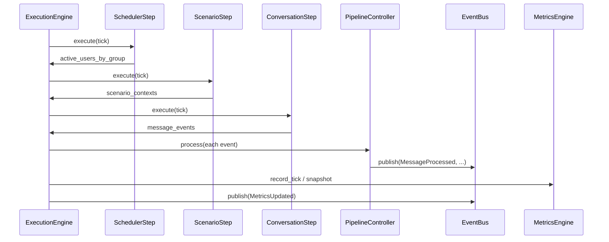

# Phase 7 — Simulation Execution Engine

This document describes the orchestration layer introduced in Phase 7. All components live under `simulator/` and remain isolated from production monitoring.

## Architecture

```
SimulationManager
        ↓
SimulationExecutionEngine
        ↓
SimulationSession
        ↓
Scheduler → Scenario Engine → Conversation Engine
        ↓
MessageEvent
        ↓
PipelineController → Pipeline Stages
        ↓
EventBus → Subscribers
```

Supporting services: **MetricsEngine**, **ResourceManager**, **CheckpointStore**.

## Execution Flow

1. **Initialize session** — load configuration, generate world (personas/groups), transition `INITIALIZING → READY`.
2. **Start** — transition to `RUNNING`, create first tick, enter loop.
3. **Each tick** — extensible steps execute in order:
   - `SchedulerStep` — active users per group
   - `ScenarioStep` — scenario context per group
   - `ConversationStep` — generate messages, convert to `MessageEvent`
   - `PipelineStep` — process events through stages
   - `MetricsStep` — resource snapshot + publish `MetricsUpdated`
   - `CheckpointStep` — periodic checkpoint (when tick % frequency == 0)
4. **Finalize** — statistics, metrics, terminal status, bus notification.

## Tick System

`SimulationTick` represents one unit of simulated time. `ExecutionConfig.tick_interval` sets the base interval (1s–1h). `simulation_speed` scales elapsed simulated seconds per tick.

## Pipeline Controller

`PipelineController` receives `MessageEvent`, builds `ProcessingContext`, runs injected stages in order, publishes notifications. Stages never reference each other.

Default stages: validation → normalization → keyword → entity → risk → behavior → relationship → alert → persistence → metrics → future placeholders.

## Processing Context

Single mutable object enriched by each stage: normalized text, keywords, entities, risk, behavior, relationships, alert, persistence flag, per-stage timings and errors.

## Event Bus

Notification only. Subscribers receive events like `MessageProcessed`, `KeywordDetected`, `RiskCalculated`, `AlertGenerated`, `SimulationStarted`, `SimulationCompleted`, `MetricsUpdated`. Adding subscribers requires zero pipeline changes.

## Simulation Session

`SimulationSession` tracks ID, name, times, status, environment, seed, configuration, counts, tick, elapsed time, statistics, metadata. Terminal sessions (`COMPLETED`, `FAILED`, `CANCELLED`) are immutable.

## State Machine

| From | Allowed |
|------|---------|
| INITIALIZING | READY, FAILED, CANCELLED |
| READY | RUNNING, CANCELLED, FAILED |
| RUNNING | PAUSED, STOPPING, FAILED, COMPLETED |
| PAUSED | RUNNING, STOPPING, CANCELLED, FAILED |
| STOPPING | COMPLETED, FAILED, CANCELLED |
| COMPLETED / FAILED / CANCELLED | (terminal) |

Illegal transitions raise `InvalidSessionTransition`.

## Configuration (`ExecutionConfig`)

- `tick_interval`, `simulation_speed`
- `max_messages_per_tick`, `max_active_conversations`, `max_active_users`
- `queue_size`, `pipeline_timeout_seconds`, `retry_count`
- `checkpoint_frequency_ticks`, `metrics_interval_ticks`, `max_ticks`

## Fault Tolerance

Pipeline stage failures are caught per stage. Configurable retries via `retry_count`. Failed stages are recorded; simulation continues when safe.

## Checkpoints

`SimulationCheckpoint` captures tick, scheduler/conversation/scenario state, metrics, statistics, session metadata. Stored in-memory via `CheckpointStore` (persistence deferred to future phases).

## Dependency Injection

`SimulationExecutionEngine` accepts injected: `ExecutionConfig`, `GenerationConfig`, `ScenarioConfig`, `PipelineController`, `EventBus`, `MetricsEngine`, `ResourceManager`, `CheckpointStore`, `GeneratedWorld`, custom `ExecutionStep` list.

## Future Extension Points

- Concurrent tick workers (steps are stateless per tick)
- Resume from checkpoint
- Additional pipeline stages (OCR, MITRE, AI classification)
- Alternate message sources (Discord, Slack, WhatsApp exports)
- Playback mode and distributed workers
- Persistent checkpoint backend

## Sequence (one tick)


