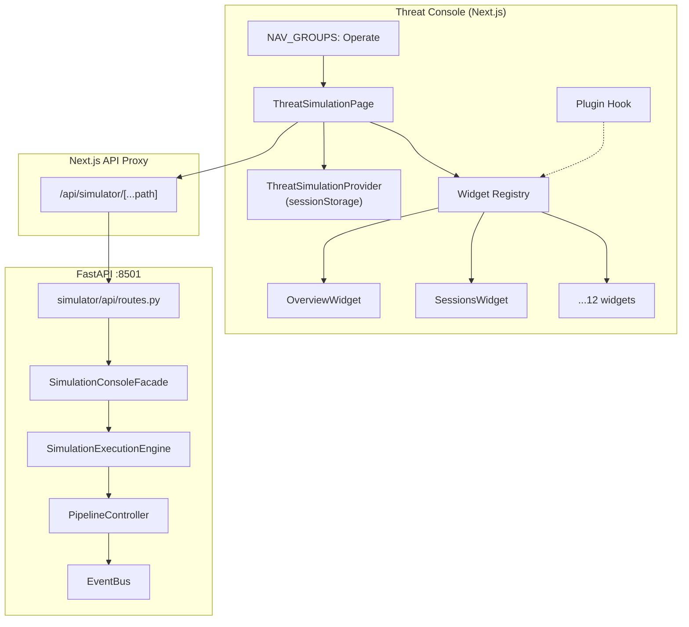

# Phase 9 — Threat Simulation Module

Threat Simulation is a first-class module inside the **Threat Console** under **Operate → Threat Simulation**. It provides an internal testing laboratory for validating the intelligence platform without touching production data.

## Isolation Guarantees

| Layer | Production | Simulation |
|-------|------------|------------|
| UI route | Command, Cases, Intel, etc. | `ThreatSimulation` page only |
| API | Existing `/api/*` endpoints | `/api/simulator/*` only |
| Backend | `database.py`, live monitoring | `simulator/` package + `SimulationConsoleFacade` |
| Environment | `PRODUCTION` | `SIMULATION` (enforced) |
| MongoDB | Unchanged | Not used by simulator console |

The only production touchpoint is an **additive** router mount in `server.py`:

```python
app.include_router(build_simulator_router())
```

## Architecture



## Page Sections

| Section | Widget | API |
|---------|--------|-----|
| Overview | `OverviewWidget` + metrics/health/architecture | `GET /overview` |
| Sessions | `SessionsWidget` | `GET/POST/DELETE /sessions` |
| Scenarios | `ScenariosWidget` | `GET/PATCH /scenarios` |
| Personas | `PersonasWidget` | `GET /personas` |
| Groups | `GroupsWidget` | `GET /groups` |
| Live Activity | `LiveActivityWidget` (virtualized) | `GET /activity` |
| Pipeline Inspector | `PipelineInspectorWidget` | `GET /pipeline/{session}/{msg}` |
| Benchmark Results | `BenchmarkWidget` | `GET /benchmark` |
| Reports | `ReportsWidget` | `GET /reports` |
| Configuration | `ConfigurationWidget` | `GET/PUT /config` |

Overview additionally renders **Real-time Metrics**, **Pipeline Health**, and **Architecture View** below the snapshot.

## Widget Registry

Widgets self-register via `registerWidgets.ts`. The page resolves the active section dynamically:

```typescript
const widget = getWidget(section);
return <widget.component sessionId={sessionId} />;
```

Future plugins use `registerThreatSimulationPlugin()` from `plugins.ts` without modifying `ThreatSimulationPage.tsx`.

Registered widgets:

- `overview`, `sessions`, `scenarios`, `personas`, `groups`
- `activity`, `pipeline`, `benchmark`, `reports`, `configuration`
- `metrics`, `architecture` (also embedded on Overview)

## State Management

```
sessionStorage["threat-simulation-state"]
  ├── section: SimSection
  ├── sessionId: string | null
  └── paused: boolean
```

State survives refresh, navigation within the Threat Console, and tab switching. Session selection persists until explicitly cleared.

## Pipeline Inspector Flow

```
Message Event
  → Validation
  → Normalization
  → Keyword Detection
  → Entity Extraction
  → Risk Scoring
  → Behavior Analysis
  → Relationship Updates
  → Alert Evaluation
  → Case Generation
  → Sebastian Indexing (stub count)
  → Final Processing Context
```

Each stage exposes latency, result, errors, and generated data via `SimulationConsoleFacade._ingest_runtime()`.

## Benchmarking

Compares expected vs actual using scenario ground truth:

- Precision / Recall / FP / FN
- Detection rate
- Keyword accuracy

Ground truth is linked when message keywords or alerts match synthetic scenario definitions.

## Performance

- **VirtualList** for Live Activity (fixed-row virtual scroll, 100k+ messages)
- Table wrappers use `max-height` + scroll
- Polling intervals: Overview 4s, Activity 3s, Metrics 3s
- Backend persona/group snapshots capped at 500/200

## Observability

Client-side ring buffer in `observability.ts`:

- Render timing per widget
- API errors
- Section navigation state changes

## Files Added

### Backend

- `simulator/api/__init__.py`
- `simulator/api/facade.py` — console facade (in-memory sessions)
- `simulator/api/routes.py` — FastAPI router
- `simulator/tests/test_simulator_api.py`

### Frontend

- `web/components/ThreatSimulationPage.tsx`
- `web/components/threat-simulation/types.ts`
- `web/components/threat-simulation/api.ts`
- `web/components/threat-simulation/store.tsx`
- `web/components/threat-simulation/widgetRegistry.ts`
- `web/components/threat-simulation/registerWidgets.ts`
- `web/components/threat-simulation/widgets.tsx`
- `web/components/threat-simulation/VirtualList.tsx`
- `web/components/threat-simulation/observability.ts`
- `web/components/threat-simulation/plugins.ts`
- `web/app/api/simulator/[...path]/route.ts`

### Modified (additive)

- `web/lib/constants.ts` — `ThreatSimulation` in Operate nav
- `web/components/DashboardApp.tsx` — page mapping
- `web/app/globals.css` — `.ts-*` styles
- `server.py` — simulator router mount
- `simulator/execution/engine.py` — `runtime_snapshot()`

## Future Extension Points

1. **Plugins** — `registerThreatSimulationPlugin(id, label, component, pluginName)`
2. **Widget Registry** — add new `SimSection` + widget, zero page changes
3. **Report formats** — PDF via server-side renderer
4. **Sebastian index count** — wire to `ai/` indexing when simulation pipeline connects
5. **Checkpoint resume** — `SimulationExecutionEngine.latest_checkpoint()`
6. **MITRE ATT&CK / OSINT / Threat Map** — register as plugin widgets

## Running

```bash
# Backend (includes /api/simulator)
python server.py

# Frontend
cd web && npm run dev
```

Navigate to **Operate → Threat Simulation**.

## Tests

```bash
pytest simulator/tests/test_simulator_api.py -q
pytest simulator/tests -q   # 102 tests
```

## Success Criteria Checklist

- [x] Threat Simulation under Operate
- [x] No production page logic changed
- [x] Existing navigation intact
- [x] Pipeline Inspector with stage lifecycle
- [x] Benchmarking with ground truth linking
- [x] Sessions CRUD (simulation-only)
- [x] Reports with JSON/CSV/Markdown export
- [x] Architecture View on Overview
- [x] Widget Registry + plugin hook
- [x] Simulation isolated from production Mongo/monitoring
